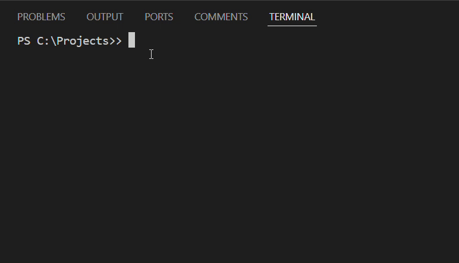

# Contributing to SEQURIQUEST_

Thank you for considering contributing to SEQURIQUEST_! Your feedback, bug reports, and code contributions help make our CTF platform more engaging and robust. Below are some guidelines to help you get started.

---

## Table of Contents

- [Getting Started](#getting-started)
- [Development Environment Setup](#development-environment-setup)
- [Coding Guidelines](#coding-guidelines)
- [Pull Request & Issue Guidelines](#pull-request--issue-guidelines)
- [Code of Conduct](#code-of-conduct)

---

## Getting Started

Before contributing, please take a moment to review these guidelines. Contributions can range from reporting bugs and suggesting new features to writing code and updating documentation.

---

## Development Environment Setup

1. **Fork the Repository:**
   - Click the "Fork" button at the top-right of the repository page to create your copy of SEQURIQUEST_.

2. **Clone Your Fork:**
   ```bash
   git clone https://github.com/<your-username>/SequriQuest.git
   cd SequriQuest
   ```

3. **Running the Project**
    - Ensure you have Node.js installed.
   ```bash
   npm install
   npm run dev
   ```



<br>


- Open [http://localhost:3000](http://localhost:3000) with your browser to see the result.

4. **Next Step**
    - You can start editing the page by modifying `app/page.tsx`. The page auto-updates as you edit the file.

>This project uses [`next/font`](https://nextjs.org/docs/app/building-your-application/optimizing/fonts) to automatically optimize and load [Geist](https://vercel.com/font), a new font family for Vercel.

## Coding Guidelines

- **Code Style:**  
  Please adhere to our established coding style and conventions. Consistent code makes it easier for everyone to read and maintain:
  - Use meaningful variable and function names.
  - Maintain a consistent indentation and formatting style.
  - Write clear and concise inline comments where necessary.
  - Utilize tools such as Prettier or ESLint to automatically format and lint your code.

- **Commit Messages:**  
  Write clear, descriptive commit messages that explain the purpose of your changes. We follow the [Conventional Commits](https://www.conventionalcommits.org/) specification:
  - Example: `feat: add new challenge hints feature` or `fix: resolve login bug on mobile devices`.

- **Documentation:**  
  Update or add documentation as needed whenever you introduce new features or modify existing functionality. Good documentation helps others understand your contributions.

- **Testing:**  
  Ensure that your changes are covered by appropriate tests. Before submitting a pull request, run the project’s test suite to make sure that your changes do not introduce regressions.

---

## Pull Request & Issue Guidelines

- **Branching:**  
  Create a new branch for each feature or bug fix:
  ```bash
  git checkout -b feature/your-feature-name


## Code of Conduct

We are committed to fostering an open, inclusive, and respectful community. All participants and contributors are expected to adhere to our [Code of Conduct](CODE_OF_CONDUCT.md). Please take a moment to read it before getting involved. If you have any concerns or need clarification, feel free to reach out to one of the project maintainers.
