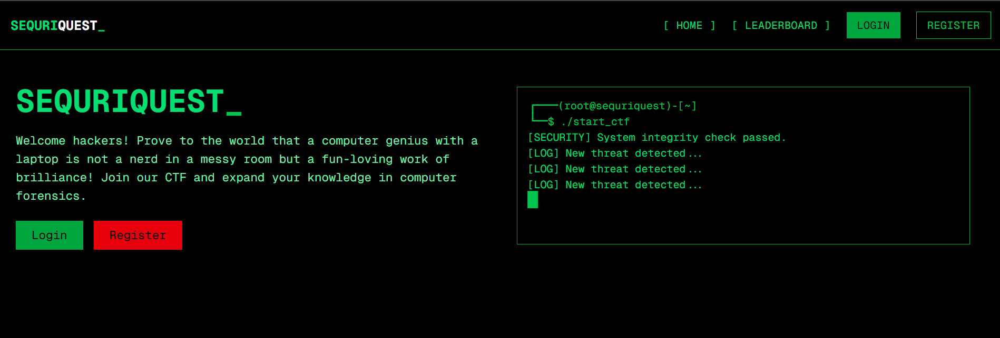

  SEQURI

  QUEST

  _

# SEQURIQUEST: A CTF PLATFORM

⭐ Star us on GitHub — it motivates us a lot!   

## Table of Contents

- [About](#🚀-about)
- [Features](#✨-features)
- [Tech Stack](#🛠️-tech-stack)
- [Feedback and Contributions](#🤝-feedback-and-contributions)
- [Thank You](#thank-you-all)

## 🚀 About 
**SEQURIQUEST** is an **open-source** immersive Capture The Flag (CTF) platform designed to challenge and expand your knowledge in computer forensics. Whether you're a seasoned hacker or new to the field, SEQURIQUEST offers a series of meticulously crafted challenges that simulate real-world scenarios, pushing you to think critically and enhance your problem-solving skills.

🔓 Being **open-source**, SEQURIQUEST thrives on community contributions, making it an evolving and dynamic platform for learning and competition.

Dive into a world where each challenge unravels a unique mystery, requiring you to apply various techniques and tools to uncover hidden information. Compete with fellow hackers, climb the leaderboard, and showcase your prowess in the realm of cybersecurity.

💡 **Want to contribute?** Check out our [CONTRIBUTING.md](CONTRIBUTING.md) to get started!

## ✨ Features

- 🔍 **Diverse Challenges:**   Engage with a wide variety of computer forensic puzzles designed to test every aspect of your skills.
- 💡 **Helpful Hints:**  Get optional hints for each challenge when you're stuck, ensuring you keep moving forward while still enjoying a challenge.

- 🏆 **Interactive Leaderboard:**  Compete against fellow hackers and see your ranking in real-time.
  

- ⚡ **Dynamic Content:**  Experience new and evolving challenges that keep you on your toes.
  

## 🛠️ Tech Stack

### Frontend

### Backend

### Deployment

## 🤝 Feedback and Contributions

We've poured our passion into building SEQURIQUEST, While we've worked hard to create engaging challenges and a seamless experience, our journey doesn't stop here—you are a vital part of our evolution.

> Whether you have suggestions for new challenges, have encountered any bugs, or want to share ideas to enhance the experience, we're eager to hear from you. Your insights help us refine SEQURIQUEST and ensure it remains both challenging and fun.

- **Have an idea or suggestion?** Open an issue!  
- **Found a bug?** Report it in [GitHub Issues](https://github.com/iiitl/SequriQuest/issues).

For details on how you can contribute, please check out our <a href="CONTRIBUTING.md" style="color: #FF4500; font-weight: bold;">CONTRIBUTING.md</a>.

## Thank you all

Special thanks to all contributors for making this project a success

**Our amazing contributors**:

 
## Crafted  by the Infosec Club of IIITL

